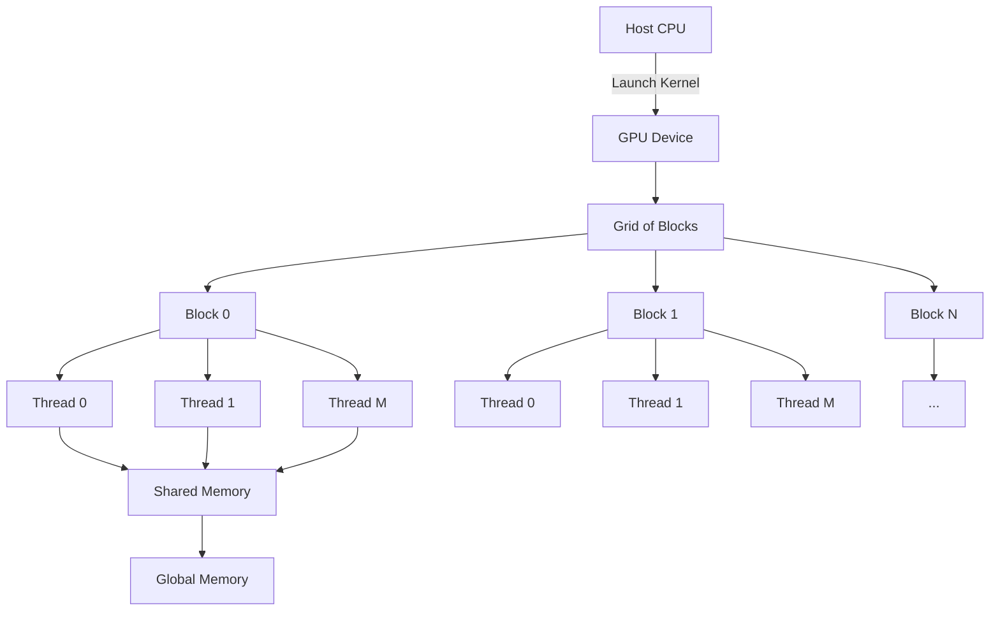
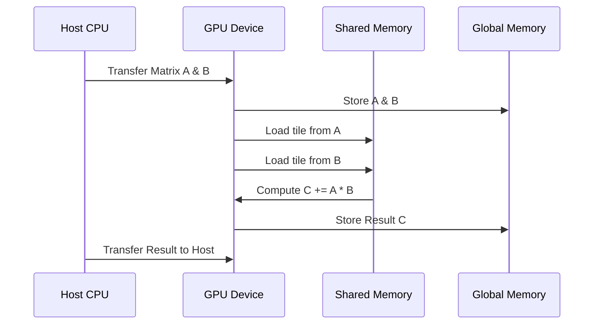
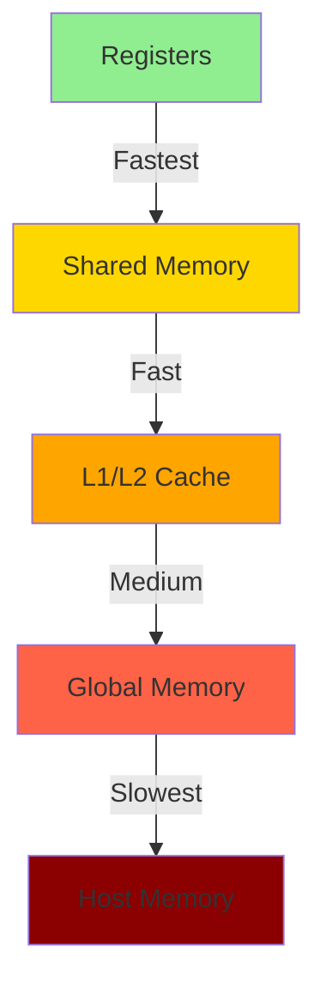

# CUDA Kernel Development and GEMM Optimization

## Overview

CUDA (Compute Unified Device Architecture) is a parallel computing platform and application programming interface (API) model created by NVIDIA. It allows developers to use a CUDA-enabled graphics processing unit (GPU) for general purpose processing.


cascas

## CUDA Architecture



## CUDA Kernels

A CUDA kernel is a function that runs on the GPU and can be called from the host (CPU). When a kernel is executed, many threads are launched to carry out the computation, allowing for significant parallelism.

### Example Kernel

Here's a simple example of a CUDA kernel that adds two vectors:

```cpp
__global__ void vectorAdd(float *A, float *B, float *C, int N) {
    int i = threadIdx.x;
    if (i < N) {
        C[i] = A[i] + B[i];
    }
}
```

## GEMM Optimization

GEMM (General Matrix Multiply) is a common operation in many scientific computing applications. Optimizing GEMM is vital for high performance.

### GEMM Workflow



### Optimized GEMM with Shared Memory

Using shared memory to store sub-matrices can significantly reduce the number of global memory accesses:

```cpp
__global__ void gemm(float *A, float *B, float *C, int N) {
    __shared__ float As[TILE_SIZE][TILE_SIZE];
    __shared__ float Bs[TILE_SIZE][TILE_SIZE];
    // ... kernel implementation continues
}
```

## Memory Hierarchy



## Conclusion

Understanding how to effectively write CUDA kernels and optimize operations like GEMM can lead to substantial performance improvements in applications that require high computational power.
